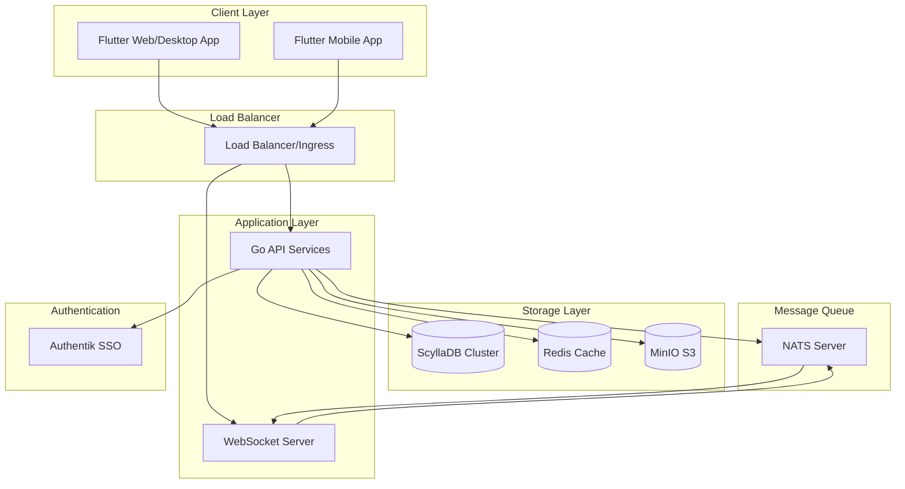
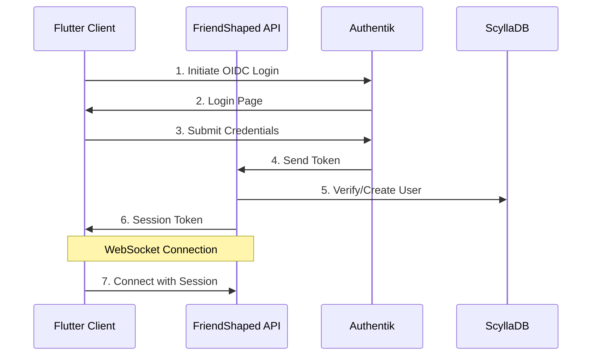
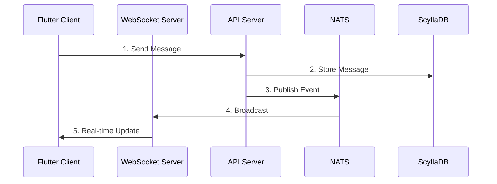
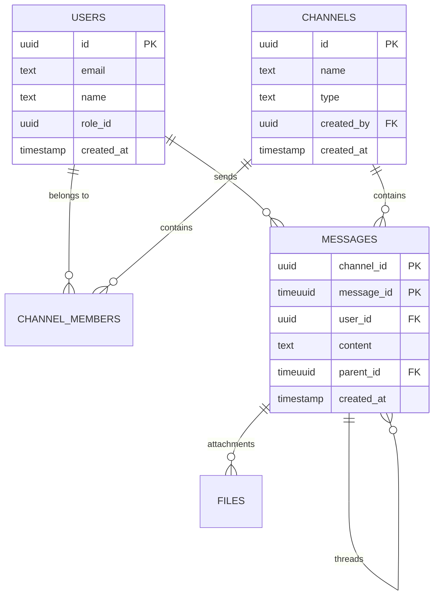
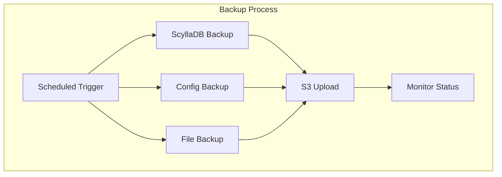

Below is a Product Requirements Document (PRD) for a self-hosted, business-focused, Slack/Discord hybrid messaging platform with enterprise-grade authentication and backup support.

---

# Product Requirements Document (PRD)

## 1. Overview

**Product Name:** _(Working Title)_ FriendShaped  
**Description:**  
FriendShaped is a self-hosted communication platform combining the best features of Slack and Discord with a business-friendly user experience. It emphasizes robust enterprise integrations including OIDC/SAML-based single sign-on (SSO) and Authentik compatibility, while ensuring secure, S3-backed data storage for backups. The platform is designed to serve organizations that demand control over their data and infrastructure without unnecessary "bells and whistles" like inbuilt AI features.

**Target Audience:**  
- Mid-to-large enterprises  
- IT departments requiring self-hosted, secure communication tools  
- Organizations needing integration with Authentik for identity management  
- Businesses that require S3-compatible backup mechanisms  

---

## 2. Business Problem Statement

**Challenges Addressed:**  
- **Data Sovereignty & Security:** Many organizations are concerned with third-party cloud services for communication due to data governance and privacy issues.  
- **Enterprise Integration:** Existing consumer-focused communication tools (like Discord) or those with "overblown" features (like inbuilt AI) are not tailored for professional use or compliance with enterprise security standards.  
- **Self-Hosting Requirements:** Companies prefer solutions that can be deployed on their own infrastructure, ensuring complete control over data and configuration.  
- **Seamless SSO Integration:** Businesses require streamlined authentication workflows that integrate with existing identity management systems (e.g., Authentik) via standards like OIDC or SAML.  
- **Reliable Backup Solutions:** Dependable integration with S3 storage for backups is essential for disaster recovery and data retention policies.

---

## 3. Goals and Objectives

1. **Enterprise-Grade UX:**  
   - Deliver a user interface that is intuitive for business users, with a professional look and feel that minimizes distractions.

2. **Robust Messaging Features:**  
   - Provide a rich messaging experience combining channels, direct messaging, threads, and file sharing, similar to Slack and Discord.
  
3. **Secure and Compliant Authentication:**  
   - Integrate OIDC/SAML authentication mechanisms, with specific support for Authentik to ensure smooth SSO workflows.

4. **Self-Hosting Capability:**  
   - Offer complete self-hosting options allowing deployment on customer-controlled servers or private cloud environments.

5. **S3-Backed Data Storage:**  
   - Ensure that all backups can be stored in and restored from S3-compatible storage systems.

6. **Business-First Tooling:**  
   - Focus solely on features that enhance business communication and collaboration without extraneous consumer-grade gimmicks (e.g., inbuilt AI functionalities).

---

## 4. Key Features and Requirements

### 4.1. Core Communication Features
- **Channels and Groups:**  
  - Support for public, private, and announcement channels.  
  - Ability to create topic-specific discussion groups.

- **Direct Messaging & Threads:**  
  - One-on-one messaging and group DMs.  
  - Threaded conversations for topic continuity.

- **File Sharing and Collaboration:**  
  - Secure file uploads/downloads with versioning.  
  - Integration with common enterprise file storage systems (optional plugins for further integrations).

- **Notifications & Mentions:**  
  - Customizable notifications for messages, mentions, and channel activities.

- **Search and Archive:**  
  - Robust search functionality for past communications and files.  
  - Archiving and retrieval systems for historical data.

### 4.2. Authentication & Security
- **OIDC/SAML Support:**  
  - Native support for industry-standard OIDC and SAML protocols.  
  - Configuration wizard for integration with enterprise identity providers.

- **Authentik Integration:**  
  - Out-of-the-box compatibility with Authentik.  
  - Detailed documentation on setting up Authentik as the primary identity management system.

- **Role-Based Access Control (RBAC):**  
  - Granular permission management based on user roles and groups.

- **Audit Logging:**  
  - Comprehensive logging of authentication events and administrative actions for compliance and monitoring.

### 4.3. Self-Hosting and Deployment
- **Containerization & Orchestration:**  
  - Provide Docker images and Kubernetes deployment manifests for ease of self-hosting.
  
- **Scalability & Performance:**  
  - Design for horizontal scaling with load-balancing support.
  - Performance monitoring tools integrated or available as add-ons.

### 4.4. Backup and Data Management
- **S3-Compatible Backup System:**  
  - Automated, scheduled backups of all messaging data and configuration settings.  
  - Easy restoration processes from S3 storage.
  
- **Data Encryption:**  
  - Encrypt data both in transit and at rest to ensure compliance with security standards.

### 4.5. Administration & Management Tools
- **Admin Dashboard:**  
  - Centralized dashboard for system administrators to manage users, channels, integrations, and monitor system health.
  
- **Monitoring and Alerts:**  
  - Integrated system health monitoring with alert capabilities for critical events.

- **Extensibility:**  
  - Plugin architecture for additional business integrations (e.g., calendar integration, CRM connectors), excluding non-business features such as inbuilt AI.

---

## 5. Non-Functional Requirements

### 5.1 Performance SLAs
- **Message Delivery:**
  - Maximum latency: < 100ms for 99.9% of messages
  - Real-time updates: < 250ms end-to-end delivery
  - Websocket connection establishment: < 1s

- **API Response Times:**
  - Read operations: < 200ms (95th percentile)
  - Write operations: < 500ms (95th percentile)
  - Search operations: < 1s (95th percentile)

- **Scalability:**
  - Support 10,000+ concurrent users per deployment
  - Handle 1000+ messages per second per channel
  - Support 100,000+ total users per organization

### 5.2 Security and Compliance
- **Security Standards:**
  - SOC 2 Type II compliance readiness
  - GDPR compliance for EU deployments
  - Data encryption (AES-256 at rest, TLS 1.3 in transit)
  - Regular penetration testing and security audits

- **Access Control:**
  - Role-based access control (RBAC)
  - IP-based access restrictions
  - Session management with automatic timeouts
  - Multi-factor authentication support

### 5.3 Reliability and Availability
- **Uptime:**
  - 99.9% service availability target
  - Maximum planned downtime: 4 hours per month
  - Automatic failover: < 30 seconds

- **Backup and Recovery:**
  - RPO (Recovery Point Objective): < 5 minutes
  - RTO (Recovery Time Objective): < 1 hour
  - Daily incremental backups
  - Weekly full backups

### 5.4 Observability
- **Logging:**
  - Structured JSON logging
  - Log retention: 90 days online, 1 year archived
  - Audit logs for security events
  - Error tracking and correlation

- **Monitoring:**
  - Real-time system metrics dashboard
  - Custom alert thresholds
  - Health check endpoints
  - Resource utilization tracking

- **Tracing:**
  - Distributed request tracing
  - Performance bottleneck identification
  - Error root cause analysis

### 5.5 Development and Testing
- **Code Quality:**
  - 80%+ test coverage requirement
  - Automated linting and formatting
  - Regular dependency updates
  - Documentation requirements for APIs

- **Testing Strategy:**
  - Unit tests for business logic
  - Integration tests for API endpoints
  - End-to-end tests for critical flows
  - Performance testing under load
  - Security vulnerability scanning

### 5.6 CI/CD Pipeline
- **Continuous Integration:**
  - Automated builds on commit
  - Test suite execution
  - Code quality checks
  - Security scanning

- **Continuous Deployment:**
  - Automated staging deployments
  - Production deployment approval process
  - Rollback capabilities
  - Configuration management

### 5.7 Documentation
- **Technical Documentation:**
  - API documentation (OpenAPI/Swagger)
  - Deployment guides
  - Configuration reference
  - Troubleshooting guides

- **User Documentation:**
  - Administrator guides
  - End-user documentation
  - Integration guides
  - Security best practices

### 5.8 Usability and User Experience
- **Interface:**
  - Responsive design (desktop, tablet, mobile)
  - < 3 clicks for common actions
  - Consistent design language
  - Accessibility compliance (WCAG 2.1)

- **User Efficiency:**
  - Quick message composition
  - Efficient navigation between channels
  - Fast search capabilities
  - Keyboard shortcuts

### 5.9 Maintainability
- **Code Organization:**
  - Modular architecture
  - Clear separation of concerns
  - Consistent coding standards
  - Comprehensive documentation

- **Configuration Management:**
  - Environment-based configurations
  - Secret management
  - Feature flags
  - A/B testing support

## 6. Technical Architecture

### 6.0. System Architecture


### 6.0.1 Authentication Flow


### 6.0.2 Message Flow


### 6.0.3 Database Relationships


### 6.0.4 Backup Flow


### 6.1. Frontend Architecture (Flutter)
- **Core Components:**
  - **State Management:** Riverpod for scalable state management and dependency injection
  - **Navigation:** Go Router for deep linking and web URL support
  - **Network Layer:** Dio for HTTP requests with interceptors for authentication
  - **WebSocket:** web_socket_channel for real-time messaging
  - **Local Storage:** Hive for offline data persistence
  - **Authentication:** flutter_appauth for OIDC/SAML integration

- **Module Structure:**
  ```
  lib/
  ├── core/               # Core utilities and shared code
  │   ├── config/        # Environment configuration
  │   ├── network/       # API client and WebSocket manager
  │   ├── storage/       # Local storage implementation
  │   └── utils/         # Shared utilities
  ├── features/          # Feature modules
  │   ├── auth/         # Authentication and authorization
  │   ├── chat/         # Messaging and channels
  │   ├── files/        # File sharing and management
  │   └── admin/        # Admin dashboard
  ├── shared/           # Shared widgets and components
  └── main.dart         # Application entry point
  ```

### 6.2. Backend Architecture (Go)
- **Core Technologies:**
  - **Web Framework:** Fiber for high-performance REST API
  - **WebSocket:** gorilla/websocket for real-time messaging
  - **Database:** ScyllaDB for high-performance, scalable storage
  - **Caching:** Redis for session management and message queuing
  - **Message Queue:** NATS for event distribution
  - **Authentication:** Golang JWT, OIDC, and SAML libraries
  - **Storage:** MinIO SDK for S3-compatible storage

- **Module Structure:**
  ```
  cmd/
  └── server/          # Application entry point
  internal/
  ├── api/            # REST API handlers
  │   ├── v1/        # API version 1
  │   └── ws/        # WebSocket handlers
  ├── auth/          # Authentication services
  │   ├── oidc/     # OIDC implementation
  │   └── saml/     # SAML implementation
  ├── config/        # Configuration management
  ├── database/      # ScyllaDB models and queries
  ├── service/       # Business logic
  └── storage/       # S3 storage implementation
  pkg/               # Shared packages
  ```

### 6.3. Database Schema
```cql
-- Keyspaces
CREATE KEYSPACE IF NOT EXISTS FriendShaped
WITH replication = {'class': 'NetworkTopologyStrategy', 'datacenter1': 3};

-- Users by ID
CREATE TABLE FriendShaped.users (
  id uuid,
  email text,
  name text,
  role_id uuid,
  created_at timestamp,
  PRIMARY KEY (id)
);

-- Users by Email (for lookups)
CREATE TABLE FriendShaped.users_by_email (
  email text,
  id uuid,
  PRIMARY KEY (email)
);

-- Channels
CREATE TABLE FriendShaped.channels (
  id uuid,
  name text,
  type text,
  created_by uuid,
  created_at timestamp,
  PRIMARY KEY (id)
);

-- Channel Members
CREATE TABLE FriendShaped.channel_members (
  channel_id uuid,
  user_id uuid,
  joined_at timestamp,
  PRIMARY KEY ((channel_id), user_id)
);

-- Messages
CREATE TABLE FriendShaped.messages (
  channel_id uuid,
  message_id timeuuid,
  user_id uuid,
  content text,
  parent_id timeuuid,  -- for threads
  created_at timestamp,
  PRIMARY KEY ((channel_id), message_id)
) WITH CLUSTERING ORDER BY (message_id DESC);

-- Message Timeline (for user feeds)
CREATE TABLE FriendShaped.message_timeline (
  user_id uuid,
  channel_id uuid,
  message_id timeuuid,
  PRIMARY KEY ((user_id), channel_id, message_id)
) WITH CLUSTERING ORDER BY (channel_id ASC, message_id DESC);

-- Files
CREATE TABLE FriendShaped.files (
  id uuid,
  name text,
  size bigint,
  mime_type text,
  s3_key text,
  uploaded_by uuid,
  uploaded_at timestamp,
  PRIMARY KEY (id)
);

-- Secondary indexes and materialized views as needed
```

### 6.4. API Design
- **REST Endpoints:**
  - `/api/v1/auth/*` - Authentication endpoints
  - `/api/v1/channels/*` - Channel management
  - `/api/v1/messages/*` - Message operations
  - `/api/v1/users/*` - User management
  - `/api/v1/files/*` - File operations
  - `/api/v1/admin/*` - Administrative functions

- **WebSocket Events:**
  ```json
  {
    "type": "message.new",
    "payload": {
      "id": "uuid",
      "channel_id": "uuid",
      "content": "string",
      "user": {}
    }
  }
  ```

### 6.5. Deployment Architecture
```yaml
services:
  api:
    image: FriendShaped/api:latest
    deploy:
      replicas: 3
    depends_on:
      - scylla
      - redis
      - nats

  frontend:
    image: FriendShaped/web:latest
    deploy:
      replicas: 2

  scylla:
    image: scylladb/scylla:5.1
    deploy:
      replicas: 3
    command: --smp 1 --memory 4G
    volumes:
      - scylla_data:/var/lib/scylla

  redis:
    image: redis:7
    volumes:
      - redis_data:/data

  nats:
    image: nats:2

  minio:
    image: minio/minio
    volumes:
      - s3_data:/data
```

---

## 7. Milestones and Timeline

1. **Requirements & Design (Month 1-2):**  
   - Finalize PRD  
   - Wireframe UI/UX  
   - Define architecture for authentication and backup systems

2. **Development Phase 1 (Month 3-6):**  
   - Implement core messaging features (channels, DMs, threads)  
   - Build initial admin dashboard  
   - Develop OIDC/SAML integration with Authentik support

3. **Development Phase 2 (Month 7-9):**  
   - Integrate S3 backup mechanisms  
   - Enhance security features (RBAC, audit logging)  
   - Refine UI/UX based on beta feedback

4. **Testing & QA (Month 10-11):**  
   - Conduct extensive security, performance, and usability testing  
   - Beta release for select customers

5. **Deployment & Launch (Month 12):**  
   - Final release and rollout  
   - Ongoing support and maintenance roadmap

---

## 8. Assumptions & Dependencies

- **Assumptions:**  
  - Target organizations have the technical expertise to manage self-hosted solutions.  
  - Authentik is the chosen identity management system; support for alternative providers may be considered as an extension.

- **Dependencies:**  
  - Reliance on third-party libraries for OIDC/SAML protocols.  
  - Dependency on AWS S3 or S3-compatible services for backup functionality.

---

## 9. Future Considerations

- **Integration Plugins:**  
  - Potential for additional enterprise integrations (e.g., project management tools, ticketing systems) if requested by customers.
  
- **Mobile Applications:**  
  - Native mobile apps (iOS/Android) might be developed in future phases for on-the-go access.

- **Analytics and Reporting:**  
  - Advanced reporting features to analyze communication patterns and system usage for enterprises.

---

## 10. Out-of-Scope

- **Inbuilt AI Features:**  
  - The platform will deliberately exclude features such as inbuilt AI to ensure focus on business tooling.
  
- **Consumer-Focused Features:**  
  - Features primarily targeting casual communication or entertainment (e.g., custom emojis beyond business needs, non-professional gamification) are not part of the core offering.

---

## 11. Approval and Next Steps

- **Review and Feedback:**  
  - Circulate this document among key stakeholders (IT, Security, and Business Leaders) for feedback.
  
- **Finalization:**  
  - Update PRD based on stakeholder input and finalize the product roadmap.

- **Kick-Off:**  
  - Initiate project planning and assign roles for the development phases.

---

This PRD lays the foundation for a robust, secure, and enterprise-ready communication tool that meets the specific needs of organizations requiring self-hosted solutions, Authentik integration, and S3-backed backups, without superfluous features.